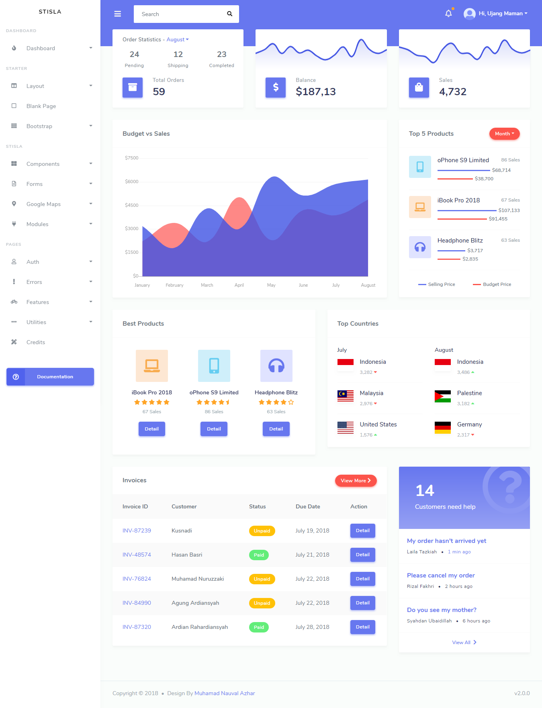
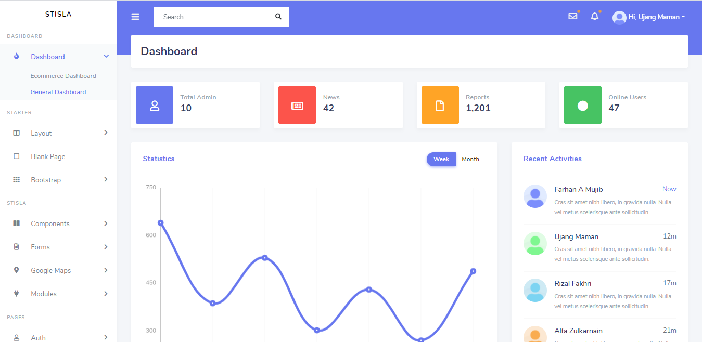
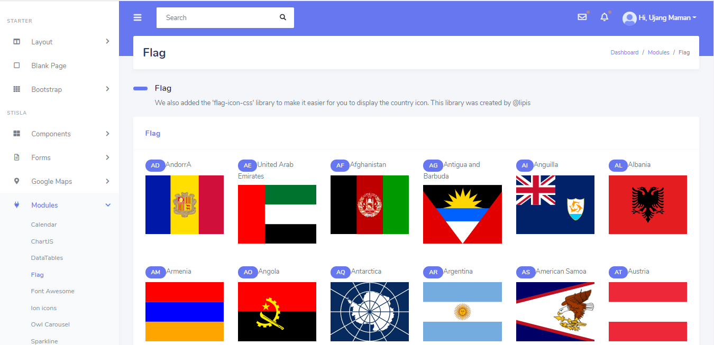

# Free React Admin Dashboard ⚡️ [](https://github.com/shivammodiin/stisla-react-free-admin-dashboard/blob/master/License.md)

<p align="center">
  <a href="https://react-free-admin-dashboard-template.netlify.app/">
    
  </a>
</p>

<h1 align="center">Stisla</h1>

<h4>
  This is a ReactJS based Free Admin  Dashboard website template.
</h4>
<br>

<span align="center">


[](LICENSE)


</span>

</br>

<br>

<p align="center">To view a live example:-   
  <a href="https://react-free-admin-dashboard-template.netlify.app/" target="_new"><b>Live url</b> </a>
</p>

<br>

<p align="center">
  <a href="https://react-free-admin-dashboard-template.netlify.app/">
    
  </a>
</p>

<br/>
 <br/>
 
<p align="center">
  <a href="https://react-free-admin-dashboard-template.netlify.app/">
    
  </a>
</p>
<p>
  
<br/>
 <br/>
  
 <p align="center">
  <a href="https://react-free-admin-dashboard-template.netlify.app/">
    
  </a>
</p>

<br/>
 <br/>

<p>

#### Stisla HTML

Stisla is a Free Bootstrap HTML Admin Template which will help you to speed up your project and design your own dashboard UI. Users will love it.**[Stisla Html](https://github.com/stisla/stisla)**

</p>

## How To Use 🔧

From your command line, first clone stisla-react-free-admin-dashboard:

```bash
# Clone this repository
$ git clone https://github.com/shivammodiin/stisla-react-free-admin-dashboard

# Go into the repository
$ cd stisla-react-free-admin-dashboard

# Remove current origin repository
$ git remote remove origin
```

Then you can install the dependencies either using NPM or Yarn:

Using NPM:

```bash
# Install dependencies
$ npm install

# Start development server
$ npm start
```

Using Yarn:

```bash
# Install dependencies
$ yarn

# Start development server
$ yarn start
```

**NOTE**:
If your run into issues installing the dependencies with NPM, use this command:

```bash
# Install dependencies with all permissions
$ sudo npm install --unsafe-perm=true --allow-root
```

Once your server has started, go to this url `http://localhost:3000/` and you will see the website running on a Development Server:

<h2 align="center">
  
</h2>

---

## Contributing

If you Want to help stisla-react-free-admin-dashboard to get better? Let's contribute and send pull request 

  **Issue**:
   => In auth section after navigate to Login or Register Page or any Page where Sidebar is not avalible and going back to HomePage  then navigation threw is not Working . On page refresh it should show Loading Indicator until data not retrieved.


## License

stisla-react-free-admin-dashboard is under the [MIT License](LICENSE)

## Netlify Quick Deploy

1. Click the [Deploy to Netlify Button](https://app.netlify.com/start/deploy?repository=https://github.com/shivammodiin/stisla-react-free-admin-dashboard)

[](https://app.netlify.com/start/deploy?repository=https://github.com/shivammodiin/stisla-react-free-admin-dashboard)
